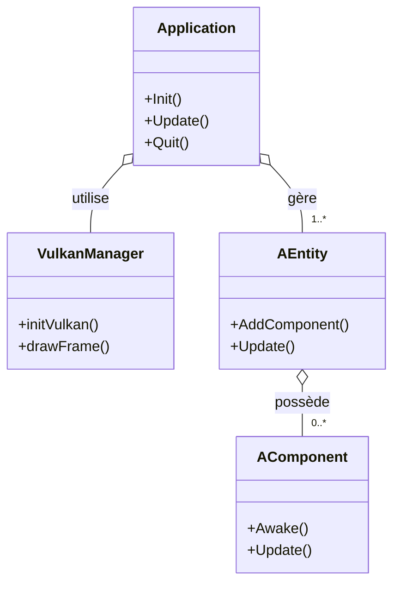

# Architecture du moteur

Ce document présente un aperçu simplifié de l'architecture de **NoNameEngine** et liste quelques bonnes pratiques pour limiter son impact environnemental.

## Schéma global

**Légende**

- `Application` orchestre la création des entités et la boucle de rendu.
- `AEntity` regroupe des `AComponent` décrivant les comportements.
- `VulkanManager` s'occupe des appels graphiques bas niveau.
- Les flèches indiquent les dépendances principales entre les éléments.

## Impact environnemental

L'utilisation de Vulkan permet de limiter les surcoûts de calcul en accédant directement au GPU. Afin de réduire l'empreinte carbone lors de l'exécution du moteur :

- Limiter le nombre de draw calls et activer le frustum culling.
- Adapter la fréquence d'affichage en fonction des besoins du jeu.
- Nettoyer les entités et composants inutilisés pour éviter une consommation mémoire et CPU superflue.

